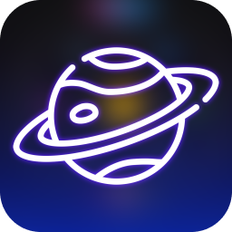
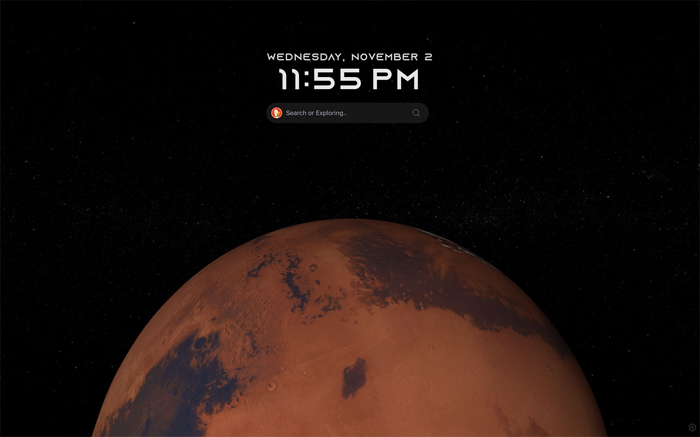
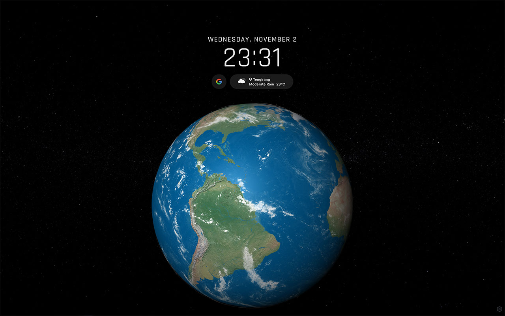
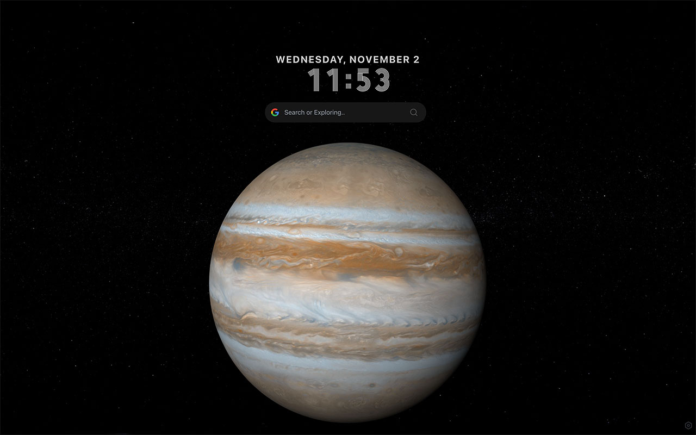

   

   

<h2 align="center">
  <strong>Planet Tab</strong>
</h2> 

  A cool dynamic 3D planet new tab, support Search, Clock, Weather and custom,
                also compatible with <a class="text-blue-500" target="_blank" href="https://haojen.github.io/vimkey/#/">Vimkey</a>

[//]: # (
)

[//]: # (  English | <a href="/README-zh.md">简体中文</a>)

[//]: # (
)

 

    

    
    

    
    
    

   

<h2>About</h2>

As an indie developer, this is my only source of income, which is why your support means so much to me, and it's a great encourage.

Star, share, comment, feedback, buy me coffee, etc.

## Buy me coffee ☕️

Copyright © HAOZHEN MA 2022
